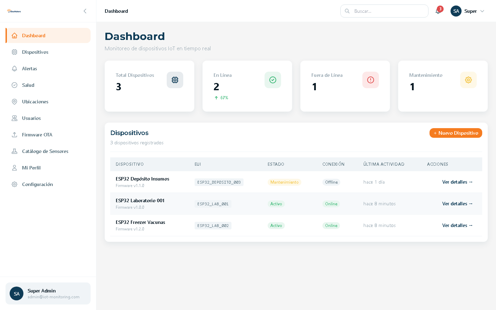
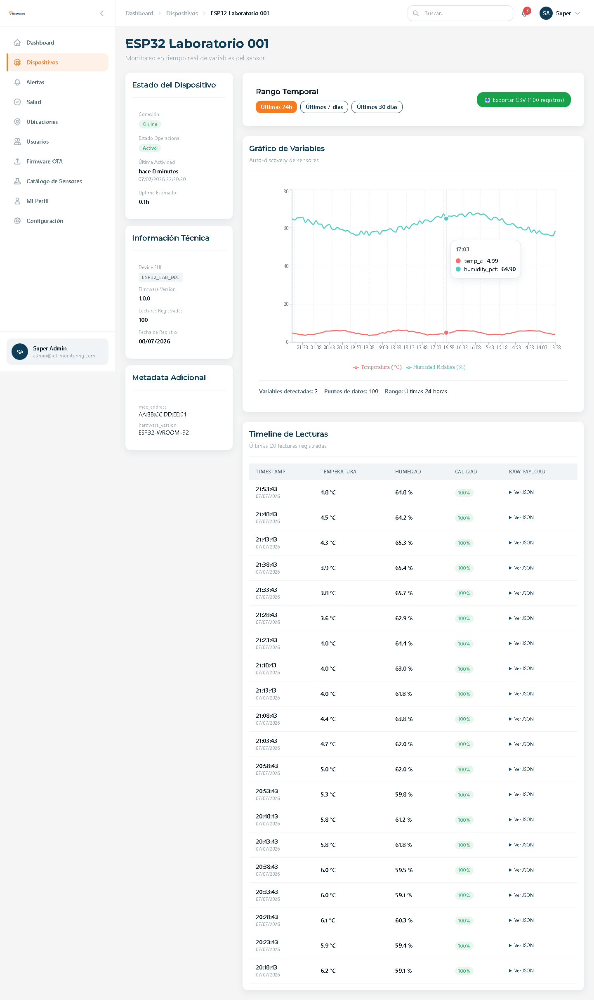
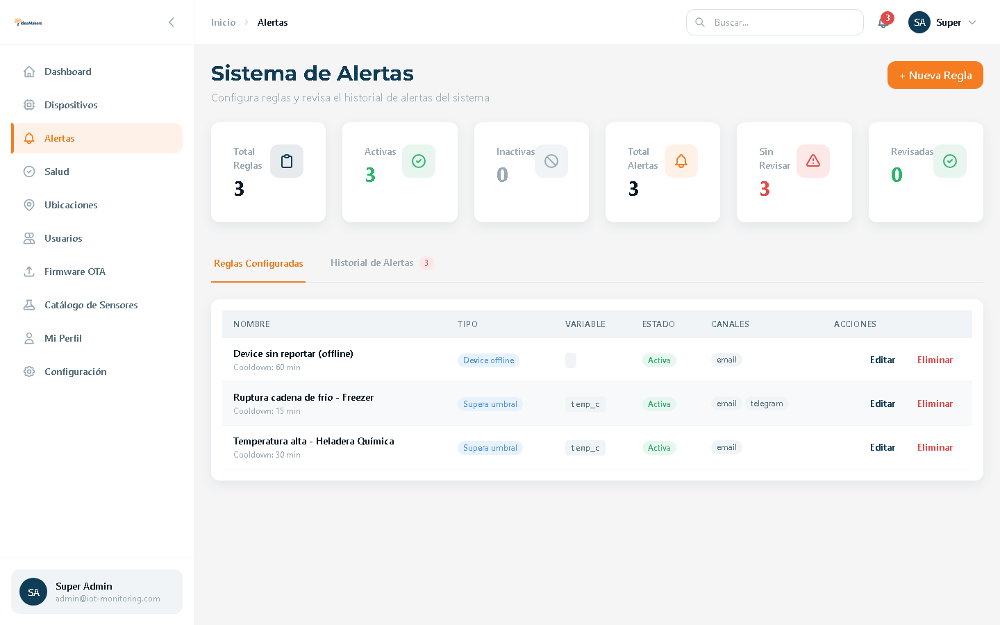
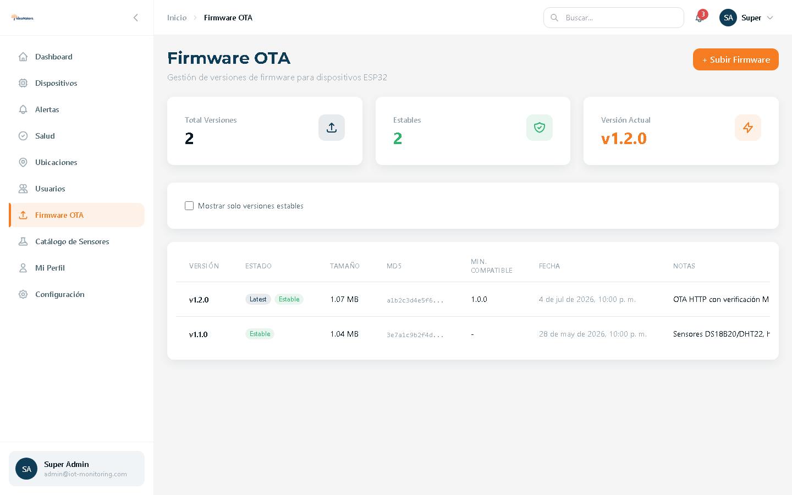
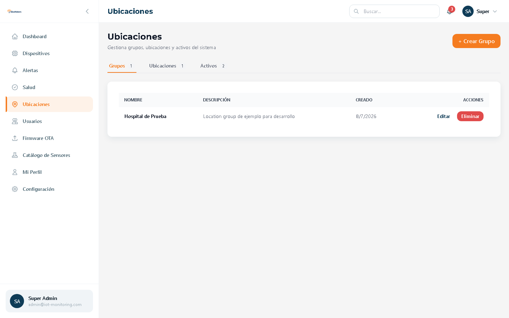

# IoT Monitoring Platform

[](https://github.com/MarceloAmado/iot-monitoring-platform/actions/workflows/ci.yml)
[](https://fastapi.tiangolo.com)
[](https://www.postgresql.org)
[](https://react.dev)
[](https://www.python.org)
[](backend/tests/)
[](LICENSE)

> Modular SCADA-lite platform for real-time IoT sensor monitoring, with automatic alerts, location-based RBAC, over-the-air firmware updates and dynamic data visualization.

**[Versión en español →](README.es.md)**

Full-stack system built end-to-end: **ESP32 firmware** (C++/PlatformIO) → **FastAPI backend** (PostgreSQL, Redis, MQTT) → **React dashboard** (TypeScript, real-time via Socket.IO). Originally designed for cold-chain monitoring in healthcare (vaccine refrigerators), but generic enough for industrial, commercial or residential telemetry.

## Highlights

- **Real-time dashboard** — new readings and device status pushed over WebSocket (Socket.IO), no polling
- **JWT auth + RBAC** — 4 roles (`super_admin`, `service_admin`, `technician`, `guest`) with per-location access scoping
- **Multi-channel alerts** — threshold/range/offline rules with cooldown, notified via Email, Telegram and Webhooks, acknowledged from the UI
- **OTA firmware updates** — upload a `.bin` from the web UI; devices check the backend, verify MD5 and flash themselves, with automatic rollback on boot failure
- **Zero-config device provisioning** — ESP32 opens a captive portal for WiFi setup; API keys stored encrypted (Fernet) server-side
- **Dynamic charts** — variables are auto-discovered from each device's JSONB payload, no schema changes needed for new sensor types
- **Locations & assets hierarchy** — Groups → Locations → Assets → Devices, all manageable from the UI
- **Audit log** — administrative actions recorded and filterable, scoped by location for non-super admins
- **CSV / Excel export** — readings exportable with filters
- **Redis cache with graceful degradation** — the system keeps working if Redis goes down

## Architecture

```
┌─────────────┐  HTTP/REST (X-API-Key)   ┌──────────────────────────┐
│   ESP32     │ ───────────────────────► │        FastAPI           │
│  (sensors)  │ ◄─────────────────────── │  ┌─────────┐ ┌────────┐  │
│ DS18B20/DHT │   OTA check + download   │  │PostgreSQL│ │ Redis │  │
│ MPX5700/... │                          │  │ (JSONB) │ │(cache) │  │
└─────────────┘                          │  └─────────┘ └────────┘  │
                                         │  ┌──────────────────┐    │
┌─────────────┐   WebSocket (Socket.IO)  │  │ Mosquitto (MQTT) │    │
│  React SPA  │ ◄──────────────────────► │  └──────────────────┘    │
│ (dashboard) │   REST (JWT Bearer)      │  Alerts: Email/Telegram/ │
└─────────────┘ ───────────────────────► │  Webhook + APScheduler   │
                                         └──────────────────────────┘
```

- **Firmware**: Arduino framework on ESP32, sensor drivers behind a common `Sensor` interface (DS18B20, DHT22, MPX5700, JSN-SR04T, generic analog), heartbeat + telemetry over HTTP, dual OTA (ArduinoOTA local + HTTP from backend with MD5 verification and rollback).
- **Backend**: FastAPI + SQLAlchemy + Alembic. Readings arrive as JSONB payloads, alerts are evaluated in background tasks, offline devices detected by an APScheduler job. Socket.IO server emits `new_reading`, `device_status` and `alert_triggered` to per-device and dashboard rooms.
- **Frontend**: React 18 + TypeScript + Vite + TailwindCSS + React Query. A custom `useWebSocket` hook invalidates queries when events arrive, so every open view updates live.

## Screenshots



| Real-time device detail | Alert rules & history |
|---|---|
|  |  |

| OTA firmware management | Locations & assets |
|---|---|
|  |  |

## Quickstart

Requirements: Docker + Docker Compose.

```bash
git clone https://github.com/MarceloAmado/iot-monitoring-platform.git
cd iot-monitoring-platform

# Configure environment (defaults work for local development)
cp .env.example .env
# Generate the required keys following the comments inside .env

docker compose up -d

# Apply migrations and seed demo data
docker exec -it iot_backend alembic upgrade head
docker exec -it iot_backend python scripts/seed.py
```

- Frontend: http://localhost:3000
- API docs (Swagger): http://localhost:8000/api/v1/docs
- Demo credentials (**local demo only**): `admin@iot-monitoring.com` / `admin123`

No physical ESP32 at hand? Use the device simulator:

```bash
python scripts/dev/simulate_esp32.py
```

## Tests & CI

```bash
# Backend: 235 tests (auth, RBAC, readings, devices, firmware OTA, cache,
# locations, assets, users, sensors, audit, alerts, notifications)
docker exec -it iot_backend pytest -v

# Frontend: vitest + testing-library
cd frontend && npm test && npm run typecheck && npm run lint
```

GitHub Actions runs three jobs on every push: **backend** (pytest against PostgreSQL 15 + Redis 7 service containers), **frontend** (lint + typecheck + tests + production build) and **firmware** (PlatformIO build for `esp32dev`).

## Role-based access control

| Role | Scope |
|------|-------|
| `super_admin` | Full access, ignores location restrictions, manages users |
| `service_admin` | Full CRUD within assigned locations |
| `technician` | Read-only within assigned locations |
| `guest` | Public dashboard, no sensitive data |

## Firmware & hardware

- PlatformIO project under [firmware/esp32-sensor](firmware/esp32-sensor/) (ESP32 DevKit v1)
- Hardware spec with pinouts, wiring diagrams and BOM: [hardware/HARDWARE_SPEC.md](hardware/HARDWARE_SPEC.md)
- Supported sensors: DS18B20 (OneWire temp), DHT22 (temp+humidity), MPX5700 (analog pressure), JSN-SR04T (ultrasonic distance), generic analog input
- Setup guides (Spanish): [GUIA_CONFIGURACION_ESP32.md](firmware/esp32-sensor/GUIA_CONFIGURACION_ESP32.md), [ACTUALIZAR_FIRMWARE_OTA.md](firmware/esp32-sensor/ACTUALIZAR_FIRMWARE_OTA.md)

## Tech stack

**Backend:** FastAPI · SQLAlchemy 2 · Alembic · PostgreSQL 15 (JSONB) · Redis 7 · python-socketio · paho-mqtt · APScheduler · Pydantic v2 · pytest
**Frontend:** React 18 · TypeScript · Vite · TailwindCSS · React Query · socket.io-client · Recharts · vitest
**Firmware:** C++ / Arduino framework · PlatformIO · WiFiManager · ArduinoJson
**Infra:** Docker Compose (PostgreSQL, Redis, Mosquitto, backend, frontend/nginx) · GitHub Actions

## License

MIT — see [LICENSE](LICENSE).

## Author

**Marcelo Amado** — [@MarceloAmado](https://github.com/MarceloAmado)

If you find this project useful, a star is appreciated ⭐
